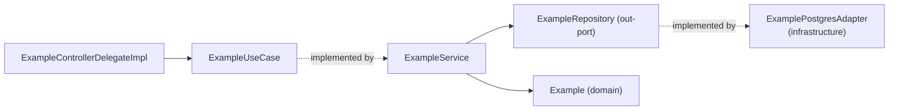

# Application Module — Summary

`code/application` is the orchestration layer. Maven deps: `contract`, `domain`, and
`spring-context` only — deliberately **not** `spring-boot-starter`, so nothing here can reach for
web, data or messaging APIs.

## Contents

```
turbo.diesel.skeletoni.application
├── command/CreateExampleCommand.java      @Value — immutable command
├── port/in/ExampleUseCase.java            inbound port
├── port/out/ExampleRepository.java        outbound port
├── service/ExampleService.java            @Service — implements ExampleUseCase
└── service/ExampleControllerDelegateImpl.java  @Component — implements the contract delegate
```

## Ports

```java
// in-port: what the outside world may ask of us
public interface ExampleUseCase {
  Example createExample(CreateExampleCommand command);
  List<Example> listExamples();
}

// out-port: what we need from the outside world
public interface ExampleRepository {
  void save(Example example);
  Optional<Example> findById(ExampleId id);
  List<Example> findAll();
}
```

`ExampleRepository` is an **application-owned** interface, not a Spring Data repository. Its
implementation (`ExamplePostgresAdapter`) lives in `infrastructure`. This is the outbound half of
the hexagon; the inbound half is the delegate pattern documented in
[../contract/rest-delegate-pattern.md](../contract/rest-delegate-pattern.md).

## `ExampleService`

```java
@Slf4j
@Service
@RequiredArgsConstructor
public class ExampleService implements ExampleUseCase {
  private final ExampleRepository exampleRepository;

  @Override
  public Example createExample(CreateExampleCommand command) {
    log.info("Creating example with name: {}", command.getName());
    Example example = Example.create(command.getName());
    exampleRepository.save(example);
    return example;
  }

  @Override
  public List<Example> listExamples() { return exampleRepository.findAll(); }
}
```

Characteristics and gaps:

- No `@Transactional`. Single-write operations are atomic by accident. **Add a transaction boundary
  here the moment a second write (or an event publish) joins `createExample`.**
- No `@CircuitBreaker` / `@Retry`, despite `resilience4j.*.instances.exampleService` being fully
  configured in `application.yml`. See [../resilience/summary.md](../resilience/summary.md).
- No event publication. `ExampleCreatedEvent` is never emitted.
- No unit test. `ExampleService` is trivially mockable (`@Mock ExampleRepository`) and per
  [../practices.md](../practices.md) every class must have one.

## CQRS status

`AGENTS.MD` prescribes `{Entity}Command` / `{Entity}CommandHandler` / `{Entity}Query` /
`{Entity}QueryHandler`. Reality is a **partial** implementation: `CreateExampleCommand` exists, but
there are no handlers and no query objects — both read and write go through the single
`ExampleService`. Treat the naming convention as the target shape, and split `ExampleService` into
handlers when a second use case appears rather than growing it.



Related: [../domain/summary.md](../domain/summary.md), [../architecture/request-flow.md](../architecture/request-flow.md)
