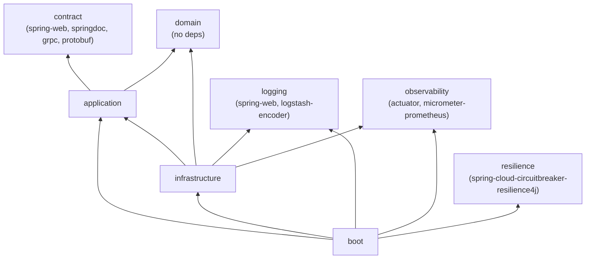
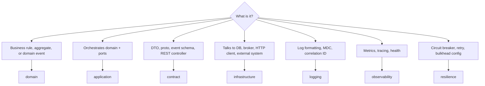

# Module Topology

The Maven reactor lives at `code/pom.xml` (packaging `pom`, parent
`spring-boot-starter-parent:4.0.3`). The repo-root `pom.xml` only declares `<module>code</module>`.

Reactor order as declared: `contract`, `application`, `domain`, `infrastructure`, `logging`,
`observability`, `boot`, `resilience`. Maven reorders by dependency graph, so declaration order is
cosmetic.

## Actual dependency edges

Notes on the real graph, which differs slightly from the prose in `AGENTS.MD`:

- `infrastructure` does **not** declare `contract` directly; it reaches it transitively via
  `application`. Do not rely on this — declare it explicitly if you add a gRPC service impl.
- `boot` does **not** declare `contract` or `domain` directly; both arrive transitively.
- `resilience` is reachable only from `boot`. Nothing else depends on it, which is why the
  circuit breaker configuration is currently inert (see [../resilience/summary.md](../resilience/summary.md)).

## Where a new class goes

## Keeping the graph legal

- Adding a dependency edge means editing a `pom.xml`. Treat that edit as an architectural decision
  and record it here.
- A "circular dependency detected" Maven failure means class placement is wrong, not that Maven is
  wrong. Move the class; do not add the reverse edge.
- Test-scope dependencies are **not** transitive. `boot` needs its own `h2` test dependency even
  though `infrastructure` already has one — this bit the project once already.

Related: [summary.md](summary.md), [../build/maven-conventions.md](../build/maven-conventions.md)
