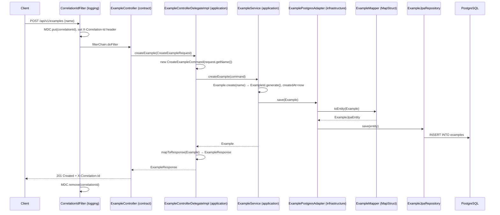

# Request Flow — `POST /api/v1/examples`

The single fully-wired vertical slice. Every new feature should reproduce this shape.

## Sequence

## Type transitions

| Boundary | In | Out |
|---|---|---|
| HTTP → controller | JSON body | `CreateExampleRequest` (contract DTO) |
| controller → delegate impl | `CreateExampleRequest` | — |
| delegate impl → service | `CreateExampleCommand` (application) | `Example` (domain) |
| service → adapter | `Example` | — |
| adapter → JPA | `ExampleJpaEntity` (infrastructure) | — |
| delegate impl → controller | `Example` | `ExampleResponse` (contract DTO) |

Domain types never cross into `contract`. DTO types never cross into `domain`. The delegate impl in
`application` is the only place both are visible.

## Read path — `GET /api/v1/examples`

Identical shape via `ExampleUseCase.listExamples()` → `ExampleRepository.findAll()` →
`repository.findAll().stream().map(mapper::toDomain).toList()`.

## What is deliberately absent

- `ExampleCreatedEvent` is **not** published after `save`. The natural extension point is an
  `ExampleEventPublisher` out-port in `application` implemented by an
  `ExampleKafkaProducer` adapter in `infrastructure`, emitting to `example-topic` per
  [../contract/messaging-and-grpc.md](../contract/messaging-and-grpc.md).
- No transaction boundary is declared. `ExampleService.createExample` is not `@Transactional`;
  the single `save` is atomic by accident, not by design. Adding a second write makes this a bug.
- No validation. `CreateExampleRequest.name` is `required` in OpenAPI but has no `@NotBlank`
  and the controller has no `@Valid`.

Related: [summary.md](summary.md), [../contract/rest-delegate-pattern.md](../contract/rest-delegate-pattern.md)
