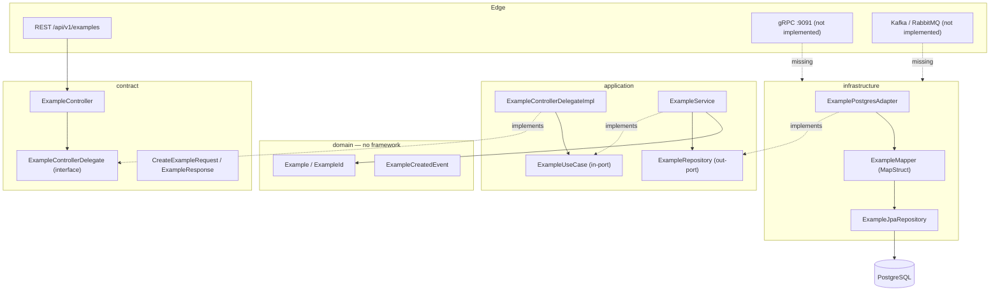

# Architecture — Summary

skeletoni is a **hexagonal (ports & adapters) multi-module Maven** service. Physical Maven module
boundaries — not package conventions — enforce the architecture: a forbidden import simply does
not compile because the dependency is absent from the POM.

## Modules

| Module | Role | Framework allowed |
|---|---|---|
| `contract` | OpenAPI/AsyncAPI/proto definitions, DTOs, REST controller + delegate interface | Spring Web, SpringDoc, gRPC stubs |
| `domain` | Aggregates, value objects, domain events. Pure Java | **None** |
| `application` | Use cases, commands, in/out ports, delegate implementations | `spring-context` only |
| `infrastructure` | All I/O: JPA, Mongo, Couchbase, Kafka, RabbitMQ, gRPC server, MapStruct mappers | Everything |
| `logging` | Correlation ID filter, MDC enrichment, Logstash encoder | Spring Web |
| `observability` | Micrometer config, custom health indicator | Actuator, Micrometer |
| `resilience` | Resilience4j wiring and event logging | Spring Cloud CircuitBreaker |
| `boot` | Composition root, `application.yml`, `logback-spring.xml`, runnable jar | Everything |

## Layer diagram

## Key architectural decisions

1. **Physical module boundaries over package discipline** — prevents the big-ball-of-mud drift that
   package-only hexagonal layouts suffer from.
2. **Delegate indirection at the REST edge** — the controller lives in `contract` (which cannot see
   `domain`), so mapping domain→DTO happens in `application`. See
   [../contract/rest-delegate-pattern.md](../contract/rest-delegate-pattern.md).
3. **MapStruct over reflection mappers** — compile-time generation, errors surface at build time.
4. **Env-var indirection for all secrets** — `${VAR}` with no default for sensitive values so a
   misconfigured environment fails fast at startup rather than silently using a dev credential.
5. **Multi-stage Dockerfile** — Maven build stage separated from a JRE-only runtime stage.

## Detail lodes

- [module-topology.md](module-topology.md) — exact dependency edges and how to keep them legal
- [request-flow.md](request-flow.md) — the `POST /api/v1/examples` path, call by call
