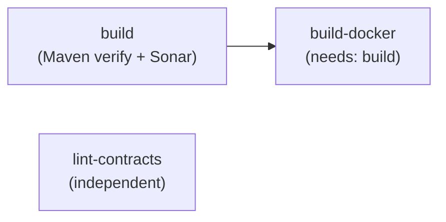

# CI/CD — GitHub Actions

Two workflows: `.github/workflows/ci.yml` and `.github/workflows/release.yml`.

> **`.github/` exists only on `feature/SKL-1`.** `origin/develop` has no workflows at all, so any
> branch cut from `develop` gets **zero CI** until that branch merges. "CI is green" currently means
> green on `feature/SKL-1` only. Verify which base a branch sits on before trusting an absence of
> failures.

Warm-cache baseline: `Build and Test` completes in 81–95s. A pom change busts the Maven cache key
and pushes that to roughly 5 minutes — see `SKL-36`.

## CI — triggers

```yaml
on:
  push:            # every branch, no path/branch filter
  pull_request:
  workflow_dispatch:
```

Intentionally unfiltered so work on feature branches is validated immediately.

## CI — three jobs



### `build` — Build and Test

Service containers: `postgres:17-alpine`, `mongo:8.0`, `apache/kafka:3.9.0`,
`confluentinc/cp-schema-registry:7.8.0`. Note **no Couchbase and no RabbitMQ service** — tests that
need them must use Testcontainers, not GitHub services.

**Do not add `SPRING_DATASOURCE_*` to this job's `env:`.** Environment variables outrank profile
YAML in Spring Boot's property source order, so they replace the H2 url in `application-test.yml`
while leaving `driver-class-name: org.h2.Driver` untouched — producing
`Driver org.h2.Driver claims to not accept jdbcUrl, jdbc:postgresql://...` and a failed context
load. The test profile is self-contained; integration tests provision their own database through
Testcontainers. This cost a red CI for some time (`SKL-35`).

Steps: checkout with `fetch-depth: 0` (Sonar needs full history for blame/relevancy) → JDK 21
temurin with Maven cache → `~/.sonar/cache` cache → build:

```bash
if [ -n "$SONAR_TOKEN" ]; then
  mvn -B clean verify sonar:sonar -f code/pom.xml
else
  echo "SONAR_TOKEN not set, skipping analysis"
  mvn -B clean verify -f code/pom.xml
fi
```

Sonar degrades gracefully on forks where the secret is unavailable. Env vars supplied to the build:
`SPRING_DATASOURCE_URL/USERNAME/PASSWORD` pointing at the Postgres service.

Surefire reports are uploaded as the `test-results` artifact with `if: always()`.

**Known fragility:** GitHub service containers have no health gate here. Maven can start before
Kafka or Postgres is ready. Testcontainers (which the ITs already use) is the more reliable path —
prefer it over adding more service containers.

Kafka listener config in CI differs from `compose.yml`: CI advertises only
`PLAINTEXT://localhost:9092` because jobs run on the host network, whereas compose needs the dual
`PLAINTEXT://kafka:29092` + `PLAINTEXT_HOST://localhost:9092` split for inter-container traffic.

### `build-docker` — Build Docker Image

`needs: build`. Buildx + `docker/build-push-action@v6`, `push: false`, tag `skeletoni:latest`,
GitHub Actions cache (`type=gha`, `mode=max`). Validates the Dockerfile; publishes nothing.

### `lint-contracts` — Lint API Contracts

Independent job. Installs `@stoplight/spectral-cli` and lints both
`code/contract/src/main/resources/openapi.yml` and `.../asyncapi.yml`.

The ruleset is `.spectral.yaml` at the repo root, extending the built-in `spectral:oas` and
`spectral:asyncapi`. **It is required, not optional**: the Spectral CLI has no implicit default and
exits with code 2 and `No ruleset has been found` without it — the job fails while linting nothing
(`SKL-34`). Four style rules (`oas3-api-servers`, `info-contact`, `info-license`, `license-url`) are
disabled because they are noise for a skeleton's example specs.

Spectral fails the job only on **errors**; warnings pass. Both contracts currently emit warnings
only (missing operation descriptions, undeclared tags, absent `servers`/`tags` in AsyncAPI).

## Release

```yaml
on:
  push:
    tags: ['v*']
```

JDK 21 → `mvn -B clean package -DskipTests -f code/pom.xml` →
`softprops/action-gh-release@v2` attaching `code/boot/target/*.jar`.

Note: `-DskipTests`. The release build trusts that CI already validated the commit — tagging an
untested commit ships an unverified jar. No Docker image is published by any workflow.

## Secrets used

| Secret | Used by | Behaviour if absent |
|---|---|---|
| `SONAR_TOKEN` | `build` | analysis skipped, build still passes |
| `GITHUB_TOKEN` | `build`, `release` | provided automatically |

## Commit conventions

Messages are prefixed by actor: `[claude]`, `[gemini]`, `[antigravity]`, `[human]`.
Current working branch is `feature/SKL-1`; the default/PR target branch is `develop`.

Related: [summary.md](summary.md), [maven-conventions.md](maven-conventions.md)
