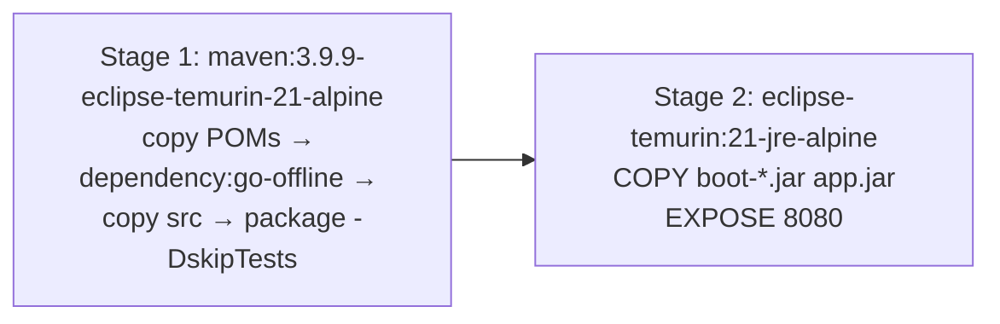

# Build — Summary

## Reactor layout

```
pom.xml                 repo root — declares only <module>code</module>
└── code/pom.xml        the real reactor: parent spring-boot-starter-parent:4.0.3, packaging pom
    ├── contract  ├── application  ├── domain  ├── infrastructure
    ├── logging   ├── observability ├── boot   └── resilience
```

Every Maven command targets `code/pom.xml`, not the root:

```bash
mvn clean install -f code/pom.xml -DskipTests   # full rebuild
mvn -B clean verify -f code/pom.xml             # what CI runs
mvn generate-sources -pl code/contract          # regenerate protobuf/gRPC stubs
```

## Coordinates & versions

| Property | Value |
|---|---|
| groupId / artifactId / version | `turbo.diesel` / `skeletoni` / `0.0.1-SNAPSHOT` |
| Java | 21 |
| Spring Boot parent | 4.0.3 |
| Spring Cloud | 2025.1.0 |
| MapStruct | 1.6.3 |
| Lombok | 1.18.36 (+ `lombok-mapstruct-binding` 0.2.0) |
| Testcontainers BOM | 1.20.4 |
| Flyway | 9.22.3 (pinned — see [../infrastructure/database-migrations.md](../infrastructure/database-migrations.md)) |
| Avro / Confluent | 1.12.0 / 7.8.0 |
| protobuf / gRPC | 4.29.3 / 1.70.0 |
| Sonar scanner plugin | 5.0.0.4389 |

Extra repository: `https://packages.confluent.io/maven/` (required for `kafka-avro-serializer`).

## Artifact

`boot` is the only module with `spring-boot-maven-plugin`, producing
`code/boot/target/boot-0.0.1-SNAPSHOT.jar`. The plugin excludes Lombok from the fat jar.

## Docker

Multi-stage `Dockerfile` at repo root:



POMs are copied before sources so the dependency layer caches across source changes. **Adding a new
module requires adding its `COPY code/<module>/pom.xml` line** — otherwise `go-offline` runs against
an incomplete reactor and the build breaks. All eight modules are currently listed, and the
requirement is commented in the Dockerfile itself.

The runtime stage copies `boot-*.jar`, so version bumps do not break the image. The glob is
unambiguous: `spring-boot-maven-plugin` also emits `boot-<version>.jar.original`, which does not
match.

## Detail lodes

- [maven-conventions.md](maven-conventions.md) — annotation processors, plugin management, gotchas
- [ci-cd.md](ci-cd.md) — GitHub Actions workflows and Sonar
