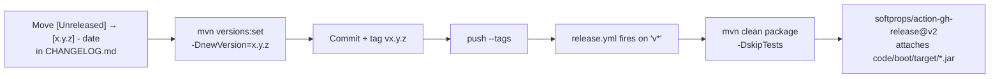

# Versioning, Changelog & Releases

## Current state

| Aspect | Reality |
|---|---|
| Scheme | Semantic Versioning 2.0.0, declared in the changelog header |
| Project version | `0.0.1-SNAPSHOT` (`code/pom.xml`; modules inherit) |
| Changelog | `code/CHANGELOG.md` — Keep a Changelog 1.0.0 format |
| Git tags | **none** — `git tag -l` is empty |
| Releases published | **none** — `release.yml` has never fired |

The release machinery exists and has never executed. Everything below describes the intended
process; SKL-30 is the ticket that runs it for the first time.

## Changelog

Format is [Keep a Changelog](https://keepachangelog.com/en/1.0.0/): an `[Unreleased]` section at the
top, then one dated section per released version, each grouping entries under `Added`, `Changed`,
`Deprecated`, `Removed`, `Fixed`, `Security`.

Entries are keyed by ticket ID, matching this project's `SKL-` prefix:

```markdown
## [Unreleased]

### Added
- **SKL-6**: Publish `ExampleCreatedEvent` to `example-topic` on example creation.

### Fixed
- **SKL-11**: Correlation ID now appears in console log output.
```

`SKL-1` (the initial scaffolding) is already recorded this way under `[Unreleased]`, which is where
the backlog's numbering continues from — see [../plans/backlog.md](../plans/backlog.md).

**Location is wrong.** `code/CHANGELOG.md` sits inside the Maven reactor directory instead of the
repo root, so GitHub does not surface it and it reads as documentation of the `code` module rather
than of the project. SKL-28 moves it.

## Version policy

Pre-1.0 (`0.x.y`), so the SemVer contract is deliberately weak: **minor versions may break
compatibility.** For a skeleton meant to be cloned and modified, that is honest — the API surface is
example code, not a supported contract.

| Bump | When |
|---|---|
| `0.x.0` minor | New capability, or any breaking change while pre-1.0 |
| `0.0.z` patch | Bug fix, dependency bump, documentation |
| `1.0.0` | Only when the skeleton's structure is considered stable enough to promise compatibility |

The version lives in exactly one place — `code/pom.xml`'s `<version>` — and every module inherits it
via `${project.version}`. Change it with `mvn versions:set -DnewVersion=<v> -f code/pom.xml`, never
by hand-editing module POMs.

## Release flow



Two defects in this flow, both ticketed:

- **`-DskipTests` on release** (SKL-24). Nothing enforces that the tagged commit ever passed CI, so
  a tag can ship an unverified jar.
- **No image is published** (SKL-24). `ci.yml`'s `build-docker` job uses `push: false`, and
  `release.yml` does not build an image at all. The Dockerfile is validated but the artifact is
  unreachable.

Also note the Dockerfile hardcodes `boot-0.0.1-SNAPSHOT.jar`, so the first version bump breaks the
image build (SKL-23).

## Commit conventions — currently contradictory

Two schemes are in simultaneous use, neither consistently:

```
[antigravity] fix ci triggers to trigger on all branches   ← AGENTS.MD actor prefix
[claude] update tasks file                                  ← AGENTS.MD actor prefix
feat: add Boot and Resilience Modules                       ← Conventional Commits
fix: fixes 11                                               ← Conventional Commits, zero information
```

`AGENTS.MD` mandates the actor prefix for multi-agent attribution; the Conventional Commits appear
only in history with nothing enforcing them. This blocks automated changelog generation and
automated version inference — a tool cannot derive a SemVer bump from `[claude]`, nor attribute
authorship from `feat:`.

The two are orthogonal and combinable. Proposed form (SKL-29 settles it):

```
<type>(<scope>): <subject> [<actor>] <TICKET>

feat(messaging): publish ExampleCreatedEvent [claude] SKL-6
fix(logging): clear MDC when filter chain throws [human] SKL-18
chore(build): parameterise jar name in Dockerfile [claude] SKL-23
```

`type` drives the SemVer bump, `scope` maps to the Maven module, `[actor]` preserves the `AGENTS.MD`
audit trail, and the ticket ID links to [../plans/backlog.md](../plans/backlog.md).

## Rules

- Every ticket that changes behaviour adds a changelog entry under `[Unreleased]`, keyed by its ID.
- Never edit a released section — corrections go in the next version.
- Version changes go through `versions:set`, never hand-edited module POMs.
- The jar version, image tag, git tag and changelog heading must always agree.

Related: [ci-cd.md](ci-cd.md), [summary.md](summary.md),
[../plans/tickets/platform.md](../plans/tickets/platform.md)
