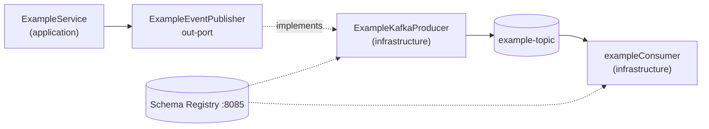

# Messaging & gRPC Contracts

Both are **declared and buildable, but unimplemented**. This lode records what exists so the
implementation can follow the contract rather than invent one.

## AsyncAPI — `asyncapi.yml`

AsyncAPI 3.0. One channel:

| Field | Value |
|---|---|
| Channel | `exampleEvents` |
| Address (topic) | `example-topic` |
| Message | `ExampleCreated` |
| Payload | `id` (uuid), `name` (string), `occurredAt` (date-time) |

The payload mirrors the domain record exactly:

```java
public record ExampleCreatedEvent(ExampleId id, String name, OffsetDateTime occurredAt) {}
```

`application.yml` already binds a consumer for this topic:

```yaml
spring.cloud.stream:
  function.definition: exampleConsumer
  bindings:
    exampleConsumer-in-0:
      destination: example-topic
      group: skeletoni-group
```

**There is no `exampleConsumer` bean.** Spring Cloud Stream will not find the function definition
at runtime. Implementing it means adding to `infrastructure`:

```java
@Bean
public Consumer<ExampleCreatedEvent> exampleConsumer() { ... }
```

Producer side needs an `ExampleEventPublisher` out-port in `application` and a Kafka adapter in
`infrastructure`, called from `ExampleService.createExample` after `save`.

## Protobuf / gRPC — `proto/example.proto`

```protobuf
syntax = "proto3";
package turbo.diesel.skeletoni;
option java_multiple_files = true;
option java_package = "turbo.diesel.skeletoni.contract.grpc";
option java_outer_classname = "ExampleProto";

service ExampleService {
  rpc GetExample (ExampleRequest) returns (ExampleResponse) {}
}
message ExampleRequest  { string id = 1; }
message ExampleResponse { string id = 1; string name = 2; }
```

- Generated into `turbo.diesel.skeletoni.contract.grpc` by `protobuf-maven-plugin`.
- Server port configured at `grpc.server.port: 9091` via
  `net.devh:grpc-server-spring-boot-starter:3.1.0.RELEASE` (in `infrastructure`).
  Use `.RELEASE`, never `.Native` — the Native variants do not resolve reliably from Central.
- **No `@GrpcService` implementation exists.** The port is configured but nothing serves it.
- Name collision hazard: the proto `ExampleService` message service and the application-layer
  `ExampleService` class share a name. The gRPC impl should be named
  `ExampleGrpcService` to avoid confusion.

## Avro / Schema Registry

`code/contract/src/main/resources/avro/` is empty. `avro-maven-plugin` and
`io.confluent:kafka-avro-serializer:7.8.0` (with `kafka-clients` excluded to avoid a version clash
with Spring Boot's managed version) are wired and ready. Schema Registry runs at
`localhost:8085` locally (`http://schema-registry:8081` inter-container).

Note the current Kafka serializer config in `application.yml` is **JSON**, not Avro:

```yaml
producer.value-serializer: org.springframework.kafka.support.serializer.JsonSerializer
consumer.value-deserializer: org.springframework.kafka.support.serializer.ErrorHandlingDeserializer
```

Switching to Avro means adding schemas, regenerating, and changing these two properties.

## Flow once implemented



Related: [summary.md](summary.md), [../plans/known-gaps.md](../plans/known-gaps.md)
