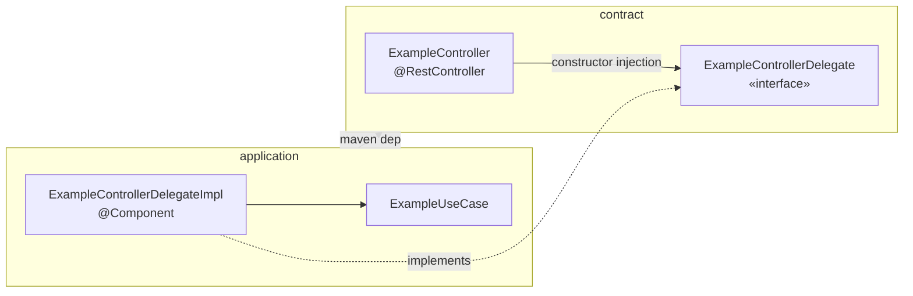

# REST Delegate Pattern

## The constraint

The REST controller lives in `contract`, but `contract` depends on **no internal module**. It
therefore cannot see `Example`, `ExampleUseCase`, or anything else in `domain`/`application`.
A controller that called a use case directly would require `contract → application`, inverting the
dependency direction and letting DTOs and domain types leak into one another.

## The resolution

`contract` declares an interface it can see, and `application` — which already depends on
`contract` — implements it. Spring injects the implementation at runtime.



Compile-time dependency: `application → contract`.
Runtime call direction: `contract → application`. Dependency inversion at the web edge, exactly
mirroring how `ExampleRepository` inverts the persistence edge.

## Implementation

```java
// contract — knows only DTOs
public interface ExampleControllerDelegate {
  ExampleResponse createExample(CreateExampleRequest request);
  List<ExampleResponse> listExamples();
}

@RestController
@RequestMapping("/api/v1/examples")
@RequiredArgsConstructor
@Tag(name = "Example", description = "Example API")
public class ExampleController {
  private final ExampleControllerDelegate delegate;

  @PostMapping
  @ResponseStatus(HttpStatus.CREATED)
  @Operation(summary = "Create a new example")
  public ExampleResponse createExample(@RequestBody CreateExampleRequest request) {
    return delegate.createExample(request);
  }
}
```

```java
// application — the only place DTOs and domain types coexist
@Component
@RequiredArgsConstructor
public class ExampleControllerDelegateImpl implements ExampleControllerDelegate {
  private final ExampleUseCase exampleUseCase;

  @Override
  public ExampleResponse createExample(CreateExampleRequest request) {
    Example example = exampleUseCase.createExample(new CreateExampleCommand(request.getName()));
    return mapToResponse(example);
  }

  private ExampleResponse mapToResponse(Example example) {
    return ExampleResponse.builder()
        .id(example.getId().value())
        .name(example.getName())
        .createdAt(example.getCreatedAt())
        .build();
  }
}
```

## Rules for new endpoints

1. Add the operation to `openapi.yml` first — Spectral lints it in CI.
2. Add DTOs to `contract/dto`.
3. Add the method to `{Entity}ControllerDelegate`, then the controller method.
4. Implement the delegate method in `application/service/{Entity}ControllerDelegateImpl`.
5. Domain→DTO mapping stays hand-written in the delegate impl. MapStruct is reserved for
   `infrastructure` (domain↔persistence) per [../practices.md](../practices.md).

## Trade-offs

- **Buys**: strict boundary enforcement at compile time; DTOs and domain types never meet outside
  one class; the controller is trivially unit-testable against a mock delegate.
- **Costs**: one extra interface + impl per controller; boilerplate mapping code the delegate impl
  must own; `contract` still carries Spring MVC on its classpath, so it is not a pure schema jar
  and cannot be published as one without splitting.
- **Alternative not taken**: generating the controller from `openapi.yml` with
  `openapi-generator-maven-plugin` in delegate mode. That would remove the hand-written controller
  entirely and make the YAML authoritative. Worth revisiting — the hand-written controller and
  `openapi.yml` can drift silently today, since nothing verifies they agree.

Related: [summary.md](summary.md), [../architecture/request-flow.md](../architecture/request-flow.md)
