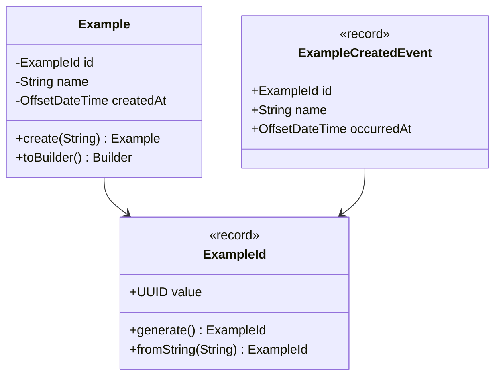

# Domain Module — Summary

`code/domain` is the purest module in the project. Its `pom.xml` declares **zero dependencies** —
it inherits only the optional Lombok dependency from the parent. No Spring, no JPA, no Jackson.
That emptiness is the invariant; guard it.

## Contents

```
turbo.diesel.skeletoni.domain
├── model/Example.java        aggregate root
├── model/ExampleId.java      value object (record over UUID)
└── event/ExampleCreatedEvent.java   domain event (record)
```

## The `Example` aggregate

```java
@Getter
@Builder(toBuilder = true)
public class Example {
  private final ExampleId id;
  private final String name;
  private final OffsetDateTime createdAt;

  public static Example create(String name) {
    return Example.builder()
        .id(ExampleId.generate())
        .name(name)
        .createdAt(OffsetDateTime.now())
        .build();
  }
}
```

Invariants held today:

- All fields `final` — the aggregate is immutable. Mutation goes through `toBuilder()`.
- Identity is generated by the domain (`ExampleId.generate()`), **not** by the database. The
  `examples` table has no sequence or default; `ExamplePostgresAdapter.save` always supplies the id.
- `createdAt` is set at construction using `OffsetDateTime.now()` — system clock, not injected.
  This makes creation time untestable to the millisecond; injecting a `Clock` is the standard fix
  if that ever matters.

Invariants **not** held:

- `name` is unvalidated. `Example.create(null)` succeeds and fails later at the `NOT NULL` column.
  Validation belongs here, in a private constructor or a factory guard — not in the controller.

## `ExampleId`

```java
public record ExampleId(UUID value) {
  public static ExampleId generate() { return new ExampleId(UUID.randomUUID()); }
  public static ExampleId fromString(String value) { return new ExampleId(UUID.fromString(value)); }
  @Override public String toString() { return value.toString(); }
}
```

Records give equality and hashing for free — this is why `assertThat(found.get().getId())
.isEqualTo(example.getId())` works in the integration test.

## `ExampleCreatedEvent`

```java
public record ExampleCreatedEvent(ExampleId id, String name, OffsetDateTime occurredAt) {}
```

Declared, schema-matched in `asyncapi.yml`, and **never constructed or published**. See
[../contract/messaging-and-grpc.md](../contract/messaging-and-grpc.md) for the intended wiring.

## Model



Related: [../application/summary.md](../application/summary.md), [../infrastructure/persistence-adapter.md](../infrastructure/persistence-adapter.md)
