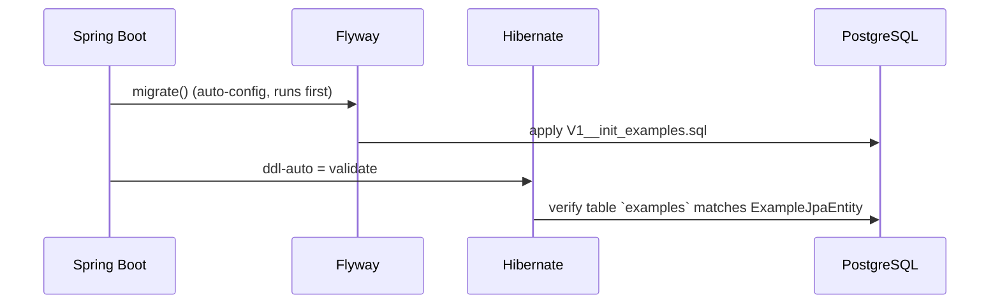

# Database Migrations — Flyway

## Layout

Migrations live in the **infrastructure** module, not `boot`:

```
code/infrastructure/src/main/resources/db/migration/V1__init_examples.sql
```

```sql
CREATE TABLE examples
(
    id         UUID PRIMARY KEY,
    name       VARCHAR(255)             NOT NULL,
    created_at TIMESTAMP WITH TIME ZONE NOT NULL
);
```

`id` has no default — the application supplies it (`ExampleId.generate()`).
`name NOT NULL` is the only enforced constraint, and it is enforced by the database rather than the
domain (see [../domain/summary.md](../domain/summary.md)).

## Version pin: Flyway 9.22.3

Deliberate downgrade, managed in `code/pom.xml`:

```xml
<flyway.version>9.22.3</flyway.version>
```

Flyway 10 split per-database support into separate artifacts (`flyway-database-postgresql`,
`flyway-database-h2`). Those artifacts resolve inconsistently through the Confluent mirror this
build uses for Avro, producing `dependency ... was not found` failures. Flyway 9.x bundles all
database support inside `flyway-core`, which is immune to mirror sync gaps.

**Do not bump to 10.x without re-verifying resolution against the Confluent repository.**

## Startup ordering



`spring.jpa.hibernate.ddl-auto: validate` in `application.yml`. If Flyway is absent or
misconfigured, Hibernate fails with:

```
org.hibernate.tool.schema.spi.SchemaManagementException: Schema validation: missing table [examples]
```

That error means Flyway did not run — check that `flyway-core` is on the `infrastructure`
classpath and that the migration path is scanned. It is not a Hibernate problem.

## Rules

- **Never edit an applied migration.** Flyway stores a checksum; editing yields
  `Migration checksum mismatch`. Locally recover with `docker compose down -v`; in any shared
  environment, always add a new `V{n}__` file.
- Naming: `V{n}__{snake_case_description}.sql`, sequential.
- Every schema change needs a matching `ExampleJpaEntity` change, or `validate` fails at startup.

## Profile behaviour

| Profile | Database | Flyway |
|---|---|---|
| `local` | PostgreSQL 17 via compose | enabled, runs V1 |
| `test` (boot context tests) | H2 in `MODE=PostgreSQL` | `spring.flyway.enabled: true`, `ddl-auto: create-drop` |
| Testcontainers ITs | real `postgres:17-alpine` | **disabled** — `withInitScript("db/migration/V1__init_examples.sql")` applies the schema instead |

The IT deliberately sets `spring.flyway.enabled=false` and `ddl-auto=none` via
`@DynamicPropertySource` so the container's init script is the single source of schema.

Related: [persistence-adapter.md](persistence-adapter.md), [../local-dev/configuration.md](../local-dev/configuration.md)
