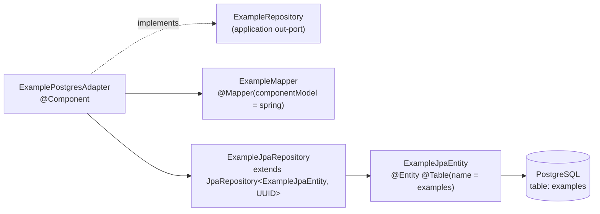

# Persistence Adapter — `Example` → PostgreSQL

The reference implementation of an outbound adapter. Copy this shape for every new aggregate.

## Pieces



## The adapter

```java
@Component
@RequiredArgsConstructor
public class ExamplePostgresAdapter implements ExampleRepository {
  private final ExampleJpaRepository repository;
  private final ExampleMapper mapper;

  @Override public void save(Example example) {
    repository.save(mapper.toEntity(example));
  }

  @Override public Optional<Example> findById(ExampleId id) {
    return repository.findById(id.value()).map(mapper::toDomain);
  }

  @Override public List<Example> findAll() {
    return repository.findAll().stream().map(mapper::toDomain).toList();
  }
}
```

Note `.toList()`, not `collect(Collectors.toList())` — Sonar rule `java:S6204` fails the quality
gate on the latter.

## The entity

```java
@Entity @Table(name = "examples") @Getter @Setter
public class ExampleJpaEntity {
  @Id private UUID id;
  private String name;
  private OffsetDateTime createdAt;
}
```

Mutable with setters, unlike the domain aggregate — JPA requires it. `id` is assigned by the domain
(`ExampleId.generate()`), never by the database: there is no `@GeneratedValue` and no sequence.
Column `created_at` maps by Hibernate's default camelCase→snake_case naming strategy.

## The mapper — the `ExampleId` trap

```java
@Mapper(componentModel = "spring",
        imports = {turbo.diesel.skeletoni.domain.model.ExampleId.class})
public interface ExampleMapper {

  @Mapping(target = "id",
      expression = "java(entity.getId() != null ? new ExampleId(entity.getId()) : null)")
  Example toDomain(ExampleJpaEntity entity);

  @Mapping(target = "id",
      expression = "java(domain.getId() != null ? domain.getId().value() : null)")
  ExampleJpaEntity toEntity(Example domain);

  default UUID map(ExampleId value)  { return value != null ? value.value() : null; }
  default ExampleId map(UUID value)  { return value != null ? new ExampleId(value) : null; }
}
```

Three things that are load-bearing and easy to break:

1. **`imports` on `@Mapper` is mandatory.** MapStruct does not auto-import types referenced inside
   `expression = "java(...)"` strings. Dropping it produces
   `cannot find symbol: class ExampleId` in generated `ExampleMapperImpl.java`.
2. **`lombok-mapstruct-binding` must stay in the parent POM's `annotationProcessorPaths`**, ordered
   after both `mapstruct-processor` and `lombok`. Without it MapStruct cannot see Lombok's generated
   builder and emits `Target bean does not have a default constructor`.
3. **`toDomain` targets a Lombok `@Builder` type.** MapStruct detects the builder automatically;
   the aggregate has no setters and no no-arg constructor, so the builder is the only route in.

The two `default map(...)` methods make `ExampleId` ↔ `UUID` convertible for any *other* field that
uses the type, which is why they coexist with the explicit `expression` mappings.

## Testing

`ExamplePostgresAdapterIT` — `@DataJpaTest` + `@Testcontainers` against `postgres:17-alpine`,
importing `ExamplePostgresAdapter.class` and the **generated** `ExampleMapperImpl.class`.

**It compiles but never executes** — `maven-failsafe-plugin` is unconfigured, so surefire skips the
`*IT` suffix. This adapter therefore has no proven test coverage. Tracked as `SKL-32`. Details in
[../testing/summary.md](../testing/summary.md).

Related: [summary.md](summary.md), [database-migrations.md](database-migrations.md)
