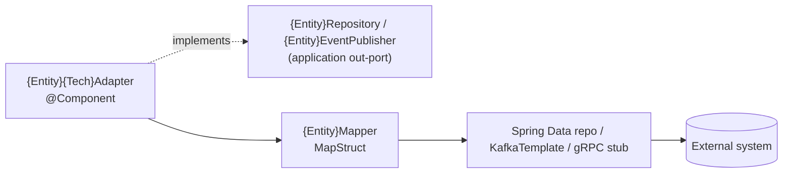

# Infrastructure Module — Summary

`code/infrastructure` is the only module permitted to touch I/O. It is also, by a wide margin, the
heaviest POM: it declares dependencies for every technology the skeleton advertises, most of which
have no code behind them yet.

## Implemented

```
turbo.diesel.skeletoni.infrastructure
├── adapter/persistence/ExamplePostgresAdapter.java   implements ExampleRepository
├── entity/ExampleJpaEntity.java                      @Entity → table `examples`
├── mapper/ExampleMapper.java                         MapStruct, componentModel = "spring"
└── repository/ExampleJpaRepository.java              Spring Data JpaRepository
src/main/resources/db/migration/V1__init_examples.sql
src/test/.../ExamplePostgresAdapterIT.java            Testcontainers Postgres 17
```

Detail: [persistence-adapter.md](persistence-adapter.md), [database-migrations.md](database-migrations.md)

## Declared but unimplemented

| Technology | Dependency present | Code present |
|---|---|---|
| MongoDB | `spring-boot-starter-data-mongodb` | none |
| Couchbase | `spring-boot-starter-data-couchbase` | none |
| Kafka | `spring-boot-starter-kafka`, `spring-cloud-stream-binder-kafka` | none |
| RabbitMQ | `spring-boot-starter-amqp`, `spring-cloud-stream-binder-rabbit` | none |
| gRPC server | `net.devh:grpc-server-spring-boot-starter:3.1.0.RELEASE` | none |
| Avro | `avro:1.12.0`, `io.confluent:kafka-avro-serializer:7.8.0` | none |

Consequence: the application context starts with auto-configuration for Mongo, Couchbase, Kafka and
Rabbit **active**, which is why `application.yml` demands `SPRING_DATA_MONGODB_URI`,
`SPRING_DATA_COUCHBASE_*` and `SPRING_RABBITMQ_*` with no defaults, and why
`application-test.yml` must exclude all four auto-configurations plus supply dummy placeholder
values. Removing an unused starter would remove that whole class of startup friction.

Notable exclusion: `kafka-avro-serializer` excludes `org.apache.kafka:kafka-clients` so Spring
Boot's managed Kafka client version wins over Confluent's.

## Adapter pattern

Every outbound integration follows this shape:



Rules:

- The adapter is a `@Component`, constructor-injected, and holds **no business logic** — it
  translates and delegates.
- Domain↔persistence mapping is MapStruct only, and MapStruct lives here and nowhere else.
- One adapter per (aggregate, technology) pair. `ExamplePostgresAdapter`, `ExampleMongoAdapter`,
  `ExampleKafkaProducer` — never a single adapter spanning two technologies.

Related: [../application/summary.md](../application/summary.md), [../testing/summary.md](../testing/summary.md)
