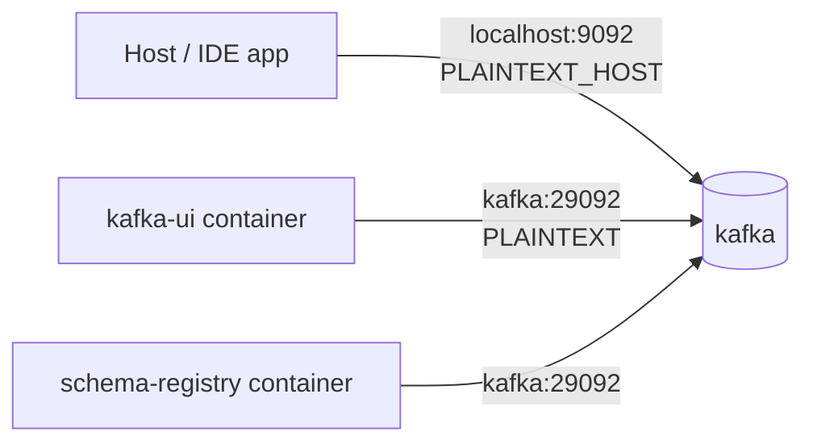

# Local Development — Summary

## Start

```bash
docker compose up -d                              # all infrastructure
mvn clean install -f code/pom.xml -DskipTests     # build
mvn spring-boot:run -f code/boot/pom.xml          # or run SkeletoniApplication from the IDE
```

Default active profile is `local` (`spring.profiles.active: local` in `application.yml`), which
loads `application-local.yml` with working credentials for every compose service.

## Compose services

| Service | Image | Host ports | Credentials |
|---|---|---|---|
| postgres | `postgres:17-alpine` | 5432 | `user` / `password`, db `skeletoni` |
| mongodb | `mongo:8.0` | 27017 | `root` / `rootpassword`, db `skeletoni` |
| couchbase | `couchbase:enterprise-7.2.0` | 8091-8096, 11210-11211 | set up manually via UI |
| kafka | `apache/kafka:3.9.0` (KRaft) | 9092 | — |
| kafka-ui | `provectuslabs/kafka-ui` | 8081 | — |
| schema-registry | `confluentinc/cp-schema-registry:7.8.0` | 8085 → 8081 | — |
| rabbitmq | `rabbitmq:4.0-management-alpine` | 5672, 15672 | `user` / `password` |
| prometheus | `prom/prometheus:v3.1.0` | 9090 | — |
| grafana | `grafana/grafana:11.5.1` | 3000 | `admin` / `admin` |

Application ports: HTTP `8080`, gRPC `9091`.

## Kafka listener topology

The single most common source of local confusion. Kafka advertises **two** listeners:



Use `localhost:9092` from your machine, `kafka:29092` from inside the compose network. A single
advertised listener makes containers try their own loopback and fail with connection refused.
Schema Registry is the mirror case: `http://localhost:8085` from the host,
`http://schema-registry:8081` between containers.

## Useful commands

```bash
docker compose logs -f              # tail everything
docker compose down -v              # nuke volumes — resets Postgres, clears Flyway history
mvn generate-sources -pl code/contract   # regenerate protobuf/gRPC stubs
```

`down -v` is the standard fix for a Flyway `Migration checksum mismatch` locally.

## Port conflicts

`Bind for 0.0.0.0:5432 failed: port is already allocated` means a local Postgres is running. Stop
it, or remap the host side in `compose.yml` (`"5433:5432"`) and update
`application-local.yml` to match.

## Endpoints

- Swagger UI: `http://localhost:8080/swagger-ui.html` (SpringDoc, from the `contract` module)
- Health: `http://localhost:8080/actuator/health`
- Prometheus scrape: `http://localhost:8080/actuator/prometheus`
- Kafka UI: `http://localhost:8081`
- RabbitMQ management: `http://localhost:15672`
- Grafana: `http://localhost:3000`

Detail: [configuration.md](configuration.md)
