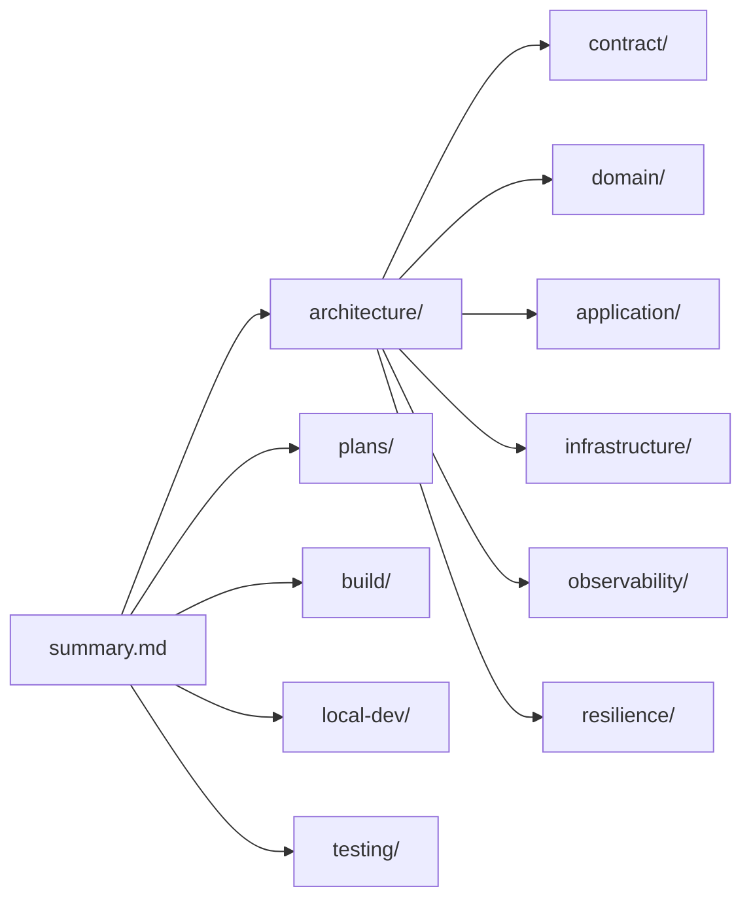

# Lode Map

Index of all lode files. Start here to find the right context before touching code.

## Root

| File | Contents |
|---|---|
| [summary.md](summary.md) | One-paragraph living snapshot + state-at-a-glance table |
| [terminology.md](terminology.md) | Domain language, hexagonal vocabulary, naming conventions |
| [practices.md](practices.md) | Hard invariants, Java style, contract-first rules, agent protocol |
| [lode-map.md](lode-map.md) | This index |

## architecture/

| File | Read it when |
|---|---|
| [architecture/summary.md](architecture/summary.md) | You need the whole-system picture and the module roles |
| [architecture/module-topology.md](architecture/module-topology.md) | Adding a dependency, placing a new class, hitting a circular-dependency error |
| [architecture/request-flow.md](architecture/request-flow.md) | Adding an endpoint or tracing how a request becomes a row |

## contract/

| File | Read it when |
|---|---|
| [contract/summary.md](contract/summary.md) | Touching DTOs, OpenAPI, protobuf or Avro codegen |
| [contract/rest-delegate-pattern.md](contract/rest-delegate-pattern.md) | Adding a REST endpoint — mandatory reading |
| [contract/messaging-and-grpc.md](contract/messaging-and-grpc.md) | Implementing Kafka, RabbitMQ or gRPC |

## domain/ · application/

| File | Read it when |
|---|---|
| [domain/summary.md](domain/summary.md) | Adding an aggregate, value object or domain event |
| [application/summary.md](application/summary.md) | Adding a use case, port, or command/query |

## infrastructure/

| File | Read it when |
|---|---|
| [infrastructure/summary.md](infrastructure/summary.md) | Adding any outbound integration |
| [infrastructure/persistence-adapter.md](infrastructure/persistence-adapter.md) | Writing an adapter or a MapStruct mapper |
| [infrastructure/database-migrations.md](infrastructure/database-migrations.md) | Changing the schema, or debugging Flyway/Hibernate startup errors |

## observability/ · resilience/

| File | Read it when |
|---|---|
| [observability/summary.md](observability/summary.md) | Anything metrics, health or logging related |
| [observability/correlation-id.md](observability/correlation-id.md) | Working on request tracing / MDC / structured logs |
| [observability/metrics-and-health.md](observability/metrics-and-health.md) | Adding metrics, dashboards or health checks |
| [resilience/summary.md](resilience/summary.md) | Adding circuit breakers, retries, or a remote call |

## build/ · local-dev/ · testing/

| File | Read it when |
|---|---|
| [build/summary.md](build/summary.md) | Building, packaging, or Dockerising |
| [build/maven-conventions.md](build/maven-conventions.md) | Adding a module or dependency; debugging codegen/annotation-processor failures |
| [build/ci-cd.md](build/ci-cd.md) | Changing workflows, Sonar, or releases |
| [build/versioning-and-releases.md](build/versioning-and-releases.md) | Cutting a release, writing changelog entries, or picking a commit message |
| [local-dev/summary.md](local-dev/summary.md) | Standing up the local stack |
| [local-dev/configuration.md](local-dev/configuration.md) | Any `application*.yml` change or placeholder failure |
| [testing/summary.md](testing/summary.md) | Writing any test, especially Testcontainers ITs |

## plans/ — the backlog

Work is tracked Jira-style with `SKL-` ticket IDs. **[plans/backlog.md](plans/backlog.md) is the
board**; start there each session.

| File | Contents |
|---|---|
| [plans/backlog.md](plans/backlog.md) | Board: sprints, statuses, priorities, dependency graph, workflow conventions |
| [plans/known-gaps.md](plans/known-gaps.md) | The divergences the tickets exist to fix — present state, not history |
| [plans/tickets/core-correctness.md](plans/tickets/core-correctness.md) | `SKL-CORE` — SKL-2 … SKL-5 |
| [plans/tickets/messaging-protocols.md](plans/tickets/messaging-protocols.md) | `SKL-MSG` — SKL-6 … SKL-10 |
| [plans/tickets/observability-resilience.md](plans/tickets/observability-resilience.md) | `SKL-OBS` — SKL-11 … SKL-17 |
| [plans/tickets/quality-gates.md](plans/tickets/quality-gates.md) | `SKL-QLTY` — SKL-18 … SKL-21 |
| [plans/tickets/platform.md](plans/tickets/platform.md) | `SKL-PLAT` — SKL-22 … SKL-25, SKL-28 … SKL-30 |
| [plans/tickets/documentation.md](plans/tickets/documentation.md) | `SKL-DOC` — SKL-26, SKL-27 |
| [plans/roadmap.md](plans/roadmap.md) | Stub — superseded by the board; delete once committed |

## tmp/

Git-ignored session scratch. Handovers, working notes, changelog-style records. Nothing durable.

## Relationship to root documentation

Root markdown files remain human-facing and are **not** replaced by this lode:

- `README.md` — public project overview
- `AGENTS.MD` — multi-agent rules and ownership map (currently stale, see known-gaps 9 & 10)
- `CONTRIBUTING.md`, `CONFIGURATIONS.md`, `KNOWLEDGE-BASE.md` — overlap heavily with this lode
- `{MODEL}-TASKS.md` — per-agent action logs (changelog-style by design)

When root docs and this lode disagree, verify against the code and fix both.
