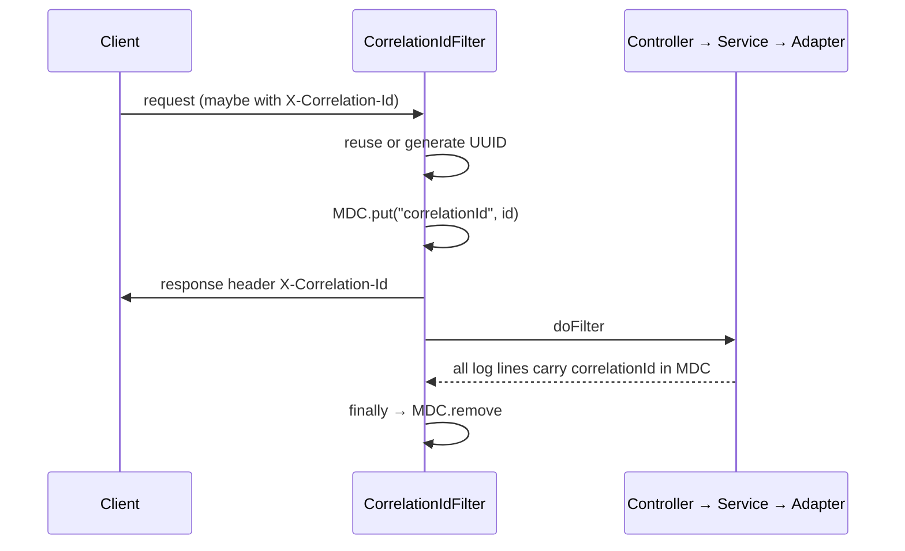

# Correlation ID Propagation

Owned by the `logging` module (`turbo.diesel.skeletoni.logging`), which depends on
`spring-boot-starter-web` and `net.logstash.logback:logstash-logback-encoder:8.0`.

## Contract

| Constant | Value |
|---|---|
| `CorrelationIdFilter.CORRELATION_ID_HEADER` | `X-Correlation-Id` |
| `CorrelationIdFilter.CORRELATION_ID_MDC_KEY` | `correlationId` |

- Inbound `X-Correlation-Id` is reused verbatim if present and non-blank.
- Otherwise a fresh `UUID.randomUUID()` is generated.
- The value is always echoed back on the response header.
- It is placed in SLF4J MDC for the duration of the request and **always** removed in a `finally`.

## Implementation

```java
@Component
@Order(Ordered.HIGHEST_PRECEDENCE)
public class CorrelationIdFilter extends OncePerRequestFilter {
  public static final String CORRELATION_ID_HEADER = "X-Correlation-Id";
  public static final String CORRELATION_ID_MDC_KEY = "correlationId";

  @Override
  protected void doFilterInternal(HttpServletRequest request, HttpServletResponse response,
                                  FilterChain filterChain) throws ServletException, IOException {
    String correlationId = request.getHeader(CORRELATION_ID_HEADER);
    if (correlationId == null || correlationId.isBlank()) {
      correlationId = UUID.randomUUID().toString();
    }
    MDC.put(CORRELATION_ID_MDC_KEY, correlationId);
    response.setHeader(CORRELATION_ID_HEADER, correlationId);
    try {
      filterChain.doFilter(request, response);
    } finally {
      MDC.remove(CORRELATION_ID_MDC_KEY);
    }
  }
}
```

`HIGHEST_PRECEDENCE` guarantees the MDC key is set before any other filter or interceptor logs.
The `finally` removal is not optional — servlet containers reuse threads, and a leaked MDC key
attaches the previous request's correlation ID to an unrelated one.



## Known limitations

1. **Servlet-only.** Scheduled tasks, `@Async` methods, Kafka listeners and gRPC calls get no
   correlation ID. Each needs its own MDC bridge (a `TaskDecorator`, a Kafka
   `RecordInterceptor`, a gRPC `ServerInterceptor`).
2. **Not propagated outbound.** No `RestClient`/`WebClient` interceptor copies the MDC value onto
   downstream calls, so the ID stops at this service's boundary.
3. **Visible in console output.** `application.yml` sets

   ```yaml
   logging.pattern.console: "%d{yyyy-MM-dd HH:mm:ss} [%thread] [%X{correlationId:-}] %-5level %logger{36} - %msg%n"
   ```

   The `:-` default keeps non-request threads (startup, scheduled work) from printing
   `correlationId_IS_UNDEFINED`. Those threads print an empty bracket pair because they have no
   correlation ID at all — that is limitation 1 above, not a formatting bug.

## Logstash appender — currently dead config

`code/boot/src/main/resources/logback-spring.xml` defines a `LogstashTcpSocketAppender` to
`localhost:5044` with a full JSON composite encoder (timestamp, message, loggerName, threadName,
logLevel, callerData, stackTrace, context, **mdc**). The `mdc` provider is what would surface the
correlation ID in structured logs.

But the root logger references only `CONSOLE`:

```xml
<root level="INFO">
  <appender-ref ref="CONSOLE" />
</root>
```

`LOGSTASH` is never attached, and there is no Logstash service in `compose.yml`. The appender is
inert. Attaching it without a listener on :5044 will produce connection-retry noise — add the
service first, or gate it behind a Spring profile with `<springProfile name="...">`.

Related: [summary.md](summary.md), [../plans/known-gaps.md](../plans/known-gaps.md)
