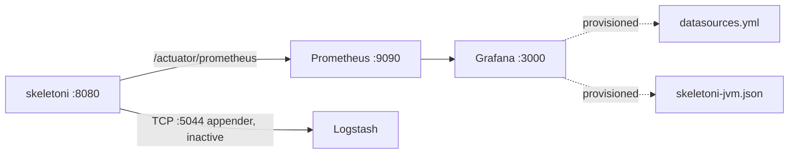

# Observability — Summary

Three concerns, two modules, one external stack.

| Concern | Module | Artefact |
|---|---|---|
| Correlation IDs / structured logs | `logging` | `CorrelationIdFilter`, `logback-spring.xml` |
| Metrics | `observability` | `MetricsConfig` → Micrometer → Prometheus |
| Health | `observability` | `ApplicationHealthIndicator` → Actuator |

## Runtime endpoints

```yaml
management:
  endpoints.web.exposure.include: health,info,prometheus,metrics
  endpoint.health.show-details: when-authorized   # `always` only on the local profile
  metrics.tags.application: ${spring.application.name}
```

- `http://localhost:8080/actuator/health`
- `http://localhost:8080/actuator/prometheus`
- Prometheus UI `http://localhost:9090` (scrape config in `infra/prometheus/prometheus.yml`)
- Grafana `http://localhost:3000`, admin/admin, provisioned datasource + the
  `infra/grafana/dashboards/skeletoni-jvm.json` dashboard



## `MetricsConfig`

```java
@Configuration
public class MetricsConfig {
  @Bean
  public MeterRegistryCustomizer<MeterRegistry> commonTags(Environment environment) {
    return registry -> registry.config().commonTags(
        "application", environment.getProperty("spring.application.name", "skeletoni"),
        "environment", environment.getProperty("spring.profiles.active", "default"));
  }
}
```

Every metric carries `application` and `environment` tags. Note the import is the Spring Boot 4
path `org.springframework.boot.micrometer.metrics.autoconfigure.MeterRegistryCustomizer` — Boot 3
tutorials use `org.springframework.boot.actuate.autoconfigure.metrics.*` and will not compile.

## `ApplicationHealthIndicator`

```java
@Component
public class ApplicationHealthIndicator implements HealthIndicator {
  @Override public Health health() {
    return Health.up().withDetail("service", "skeletoni")
                      .withDetail("status", "operational").build();
  }
}
```

Currently a constant `UP` — it checks nothing. It exists as the extension point for real readiness
probes (broker reachability, downstream health). Boot 4 import path:
`org.springframework.boot.health.contributor.{Health,HealthIndicator}`.

## No distributed tracing

There is no Micrometer Tracing / OpenTelemetry dependency anywhere. Correlation is header-and-MDC
only — traces do not propagate across service boundaries beyond `X-Correlation-Id`.

## Detail lodes

- [correlation-id.md](correlation-id.md)
- [metrics-and-health.md](metrics-and-health.md)
