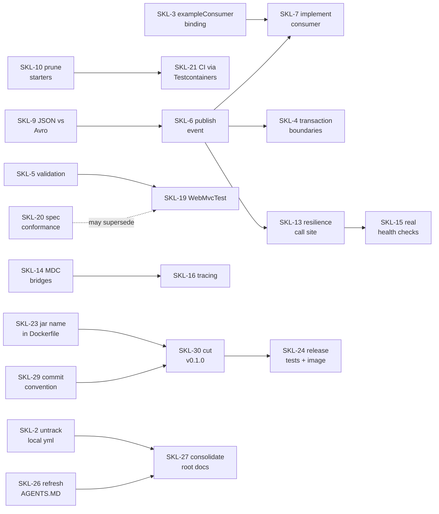

# Backlog — Board

Jira-style tracking for skeletoni. **This file is the board**; ticket detail lives in
[tickets/](tickets/) grouped by epic. Ticket IDs use the repo's `SKL-` prefix and are never reused.

`SKL-1` is the in-flight branch (`feature/SKL-1`): cross-cutting module scaffolding — `logging`,
`observability`, `resilience` sources, Grafana provisioning, and the REST delegate refactor.
New work starts at `SKL-2`.

## Conventions

| Field | Values |
|---|---|
| Type | `Bug` (behaviour is wrong) · `Story` (new capability) · `Task` (defined change) · `Chore` (hygiene) |
| Priority | `P0` ship-blocker · `P1` next sprint · `P2` scheduled · `P3` opportunistic |
| Status | `Todo` · `In Progress` · `Blocked` · `In Review` · `Done` |
| Estimate | `XS` <30min · `S` <2h · `M` <1day · `L` multi-day |

Workflow rules:

- One branch per ticket: `feature/SKL-<n>`, off `develop`.
- Commit prefix stays actor-based per `AGENTS.MD`: `[claude] SKL-7: implement exampleConsumer`.
- A ticket is `Done` only when its acceptance criteria all pass **and** the affected lode files are
  updated in the same change. Updating the lode is part of the ticket, not a follow-up.
- When a ticket closes, set its status here, and delete the corresponding entry from
  [known-gaps.md](known-gaps.md) — that file describes present reality, not resolved history.

## Epics

| Epic | Theme | File |
|---|---|---|
| `SKL-CORE` | Correctness and invariant violations | [tickets/core-correctness.md](tickets/core-correctness.md) |
| `SKL-MSG` | Events, messaging, protocols | [tickets/messaging-protocols.md](tickets/messaging-protocols.md) |
| `SKL-OBS` | Observability and resilience | [tickets/observability-resilience.md](tickets/observability-resilience.md) |
| `SKL-QLTY` | Tests and contract verification | [tickets/quality-gates.md](tickets/quality-gates.md) |
| `SKL-PLAT` | Build, config, release | [tickets/platform.md](tickets/platform.md) |
| `SKL-DOC` | Documentation truth | [tickets/documentation.md](tickets/documentation.md) |

## Sprint 1 — "make it honest"

Cheap fixes that remove false signals. Everything here is XS/S except SKL-10.

| ID | Type | Pri | Est | Title | Status |
|---|---|---|---|---|---|
| SKL-32 | Bug | P0 | S | Integration tests never execute — no failsafe plugin | Todo |
| SKL-3 | Bug | P0 | S | Resolve `exampleConsumer` binding that has no bean | Todo |
| SKL-10 | Task | P1 | M | Prune or gate unimplemented starters | Todo |
| SKL-31 | Bug | P0 | S | `ExamplePostgresAdapterIT` does not compile — build was red | **Done** |
| SKL-33 | Bug | P0 | XS | Keep the Avro source directory present in a fresh clone | **Done** |
| SKL-34 | Bug | P0 | XS | Add the Spectral ruleset the lint job requires | **Done** |
| SKL-35 | Bug | P0 | XS | Stop overriding the test datasource from CI env vars | **Done** |
| SKL-2 | Bug | P0 | XS | Untrack `application-local.yml` from git index | **Done** |
| SKL-11 | Bug | P1 | XS | Add `%X{correlationId}` to console log pattern | **Done** |
| SKL-22 | Chore | P2 | XS | Move dev-only settings into the `local` profile | **Done** |
| SKL-23 | Chore | P2 | XS | Parameterise jar name in Dockerfile | **Done** |
| SKL-25 | Chore | P3 | XS | Remove unused `app.scheduler.example-cron` | **Done** |

`SKL-32` is the immediate blocker: `mvn verify` is green but executes exactly one test, so no ticket
whose acceptance depends on an integration test can actually be verified. Detail:
[tickets/core-correctness.md](tickets/core-correctness.md).

### Lesson from SKL-33/34/35

All three were **invisible locally and fatal in CI**, and all three predate this backlog — CI had
been red long enough that its failure stopped being read. A green local build proves less than it
appears to:

| Ticket | Why local passed | Why CI failed |
|---|---|---|
| SKL-33 | empty `avro/` dir exists on disk | git does not track empty directories |
| SKL-34 | lint job never runs locally | Spectral CLI has no default ruleset |
| SKL-35 | no `SPRING_DATASOURCE_*` in the shell | workflow exported them, clobbering the H2 url |

Before claiming a change is verified, ask what the CI environment supplies or withholds that a
developer machine does not.

## Sprint 2 — "complete the vertical slice"

SKL-6 is the fulcrum: it activates events, messaging and resilience in one change.

| ID | Type | Pri | Est | Title | Status |
|---|---|---|---|---|---|
| SKL-6 | Story | P1 | M | Publish `ExampleCreatedEvent` via out-port + Kafka adapter | Todo |
| SKL-4 | Bug | P1 | S | Add transaction boundaries to use-case methods | Todo |
| SKL-5 | Bug | P1 | S | Add input validation across the slice | Todo |
| SKL-7 | Story | P2 | S | Implement `exampleConsumer` for `example-topic` | Todo |
| SKL-13 | Story | P2 | S | Wire Resilience4j to a real remote call site | Todo |
| SKL-9 | Task | P2 | S | Decide JSON vs Avro for Kafka payloads | Todo |

## Sprint 3 — "quality gates"

| ID | Type | Pri | Est | Title | Status |
|---|---|---|---|---|---|
| SKL-18 | Task | P1 | M | Unit tests for application, mapper and filter | Todo |
| SKL-19 | Task | P2 | S | `@WebMvcTest` for `ExampleController` | Todo |
| SKL-20 | Story | P2 | M | Verify controller against `openapi.yml` | Todo |
| SKL-21 | Task | P2 | M | Replace CI service containers with Testcontainers | Todo |
| SKL-8 | Story | P2 | M | Implement `ExampleGrpcService` | Todo |

## Backlog — unscheduled

| ID | Type | Pri | Est | Title | Status |
|---|---|---|---|---|---|
| SKL-12 | Task | P2 | S | Attach or remove the Logstash appender | Todo |
| SKL-36 | Task | P2 | S | CI resolves the whole dependency tree twice per run | Todo |
| SKL-28 | Chore | P2 | XS | Move `CHANGELOG.md` to the repo root | Todo |
| SKL-29 | Chore | P2 | S | Settle the commit message convention | Todo |
| SKL-30 | Task | P2 | S | Cut `v0.1.0` and establish the tag → release flow | Todo |
| SKL-24 | Task | P2 | S | Stop skipping tests on release; publish the image | Todo |
| SKL-26 | Chore | P2 | S | Refresh `AGENTS.MD` ownership map and module tree | Todo |
| SKL-14 | Story | P3 | M | MDC bridges for async, scheduled and Kafka contexts | Todo |
| SKL-15 | Task | P3 | S | Real checks in `ApplicationHealthIndicator` | Todo |
| SKL-16 | Story | P3 | L | Distributed tracing (Micrometer Tracing + OTel) | Todo |
| SKL-17 | Story | P3 | M | Business metrics and a dashboard beyond JVM | Todo |
| SKL-27 | Chore | P3 | M | Consolidate `KNOWLEDGE-BASE.md` / `CONFIGURATIONS.md` into the lode | Todo |

## Dependency graph

Note SKL-9 gates SKL-6: choosing Avro after the producer exists means rewriting it.
SKL-23 and SKL-29 gate SKL-30: a version bump breaks the Docker build until the jar name is a glob,
and no changelog discipline is possible while two commit conventions compete.

## Release tracking

Versioning, changelog format and the release flow are documented in
[../build/versioning-and-releases.md](../build/versioning-and-releases.md).

Every ticket that changes behaviour adds an entry under `[Unreleased]` in the changelog, keyed by
its ID — the same convention `SKL-1` already uses.

Related: [known-gaps.md](known-gaps.md) — the state these tickets exist to fix.
