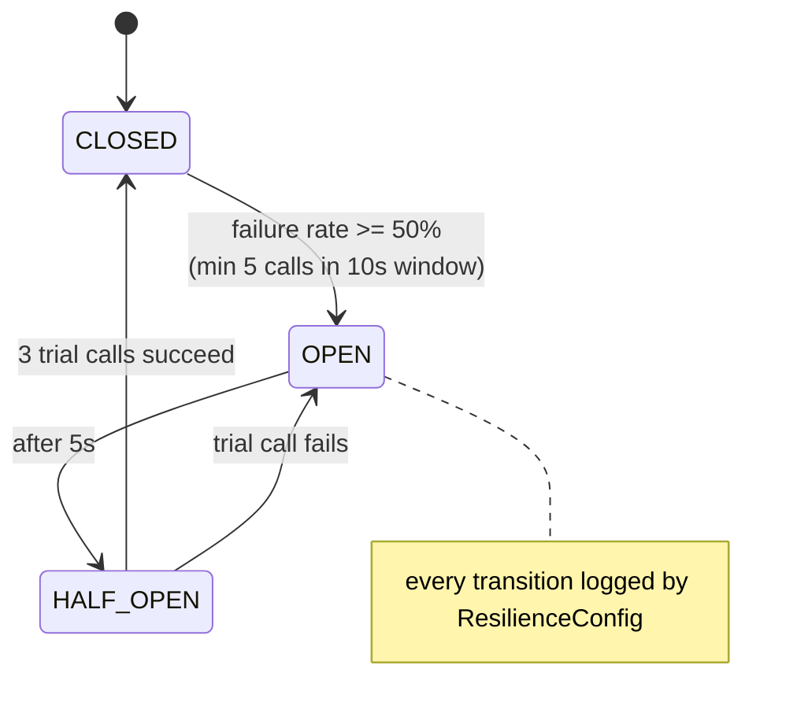

# Resilience Module

`code/resilience` holds Resilience4j wiring. Single dependency:
`org.springframework.cloud:spring-cloud-starter-circuitbreaker-resilience4j`
(version managed by `spring-cloud-dependencies:2025.1.0`). Only `boot` depends on this module.

## Configuration — `application.yml`

```yaml
resilience4j:
  circuitbreaker:
    instances:
      exampleService:
        registerHealthIndicator: true
        slidingWindowType: TIME_BASED
        slidingWindowSize: 10
        minimumNumberOfCalls: 5
        permittedNumberOfCallsInHalfOpenState: 3
        waitDurationInOpenState: 5s
        failureRateThreshold: 50
        eventConsumerBufferSize: 10
  retry:
    instances:
      exampleService:
        maxAttempts: 3
        waitDuration: 1s
        enableExponentialBackoff: true
        exponentialBackoffMultiplier: 2
```

Effective behaviour of the `exampleService` instance, **once something uses it**: over a 10-second
sliding window, after at least 5 calls, a ≥50% failure rate opens the breaker for 5 seconds, then
3 trial calls decide whether to close. Retries: up to 3 attempts with exponential backoff
1s → 2s → 4s.

Note the retry and circuit-breaker instances share the name `exampleService`, which is *not* the
same thing as the `ExampleService` bean — instance names are arbitrary configuration keys.

## `ResilienceConfig`

```java
@Slf4j
@Configuration
public class ResilienceConfig {
  public ResilienceConfig(CircuitBreakerRegistry circuitBreakerRegistry,
                          RetryRegistry retryRegistry) {
    circuitBreakerRegistry.getEventPublisher().onEntryAdded(event -> {
      var cb = event.getAddedEntry();
      log.info("CircuitBreaker '{}' registered", cb.getName());
      cb.getEventPublisher().onStateTransition(e ->
          log.warn("CircuitBreaker '{}' state transition: {}", cb.getName(), e.getStateTransition()));
    });
    retryRegistry.getEventPublisher().onEntryAdded(event ->
        log.info("Retry '{}' registered", event.getAddedEntry().getName()));
  }
}
```

Pure observability wiring — it logs registration and every state transition. It does not decorate
anything. Registries populate lazily, so these log lines appear when an instance is first used, not
at startup.



## The gap

**No call site is annotated.** `ExampleService` has no `@CircuitBreaker` or `@Retry`, so the
configuration is inert and `ResilienceConfig`'s listeners never fire.

Where it *should* go: an adapter making a genuinely remote call — an HTTP client, a Kafka publish,
a gRPC call. Wrapping `ExamplePostgresAdapter` would be wrong; connection-pool failures are better
handled by HikariCP timeouts than by a breaker.

Target shape once a remote call exists:

```java
@CircuitBreaker(name = "exampleService", fallbackMethod = "fallback")
@Retry(name = "exampleService")
public ExampleResponse fetchRemote(String id) { ... }

private ExampleResponse fallback(String id, Throwable t) { ... }
```

Retry wraps circuit breaker by default in Spring Cloud CircuitBreaker's aspect ordering — verify
the order matches intent before relying on it.

Related: [../observability/metrics-and-health.md](../observability/metrics-and-health.md), [../plans/known-gaps.md](../plans/known-gaps.md)
