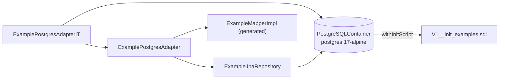

# Testing

Stack: JUnit 5, AssertJ, Mockito, Testcontainers 1.20.4 (BOM-managed), H2 for context tests.
JUnit 4 and PowerMock are explicitly not approved.

## What exists

| Test | Module | Kind | State |
|---|---|---|---|
| `SkeletoniApplicationTests` | `boot` | `@SpringBootTest` context load | passes |
| `ExamplePostgresAdapterIT` | `infrastructure` | `@DataJpaTest` + Testcontainers | compiles, **never executes** |

That is the entire suite. `ExampleService`, `ExampleControllerDelegateImpl`, `ExampleController`,
`ExampleMapper` and `CorrelationIdFilter` have **no tests**, which violates
[../practices.md](../practices.md).

> **`*IT` classes do not run.** `mvn verify` is green but reports `Tests run: 1`.
> `maven-failsafe-plugin` is not configured, and `maven-surefire-plugin`'s default includes
> (`**/Test*.java`, `**/*Test.java`, `**/*Tests.java`, `**/*TestCase.java`) do not match the `*IT`
> suffix. `ExamplePostgresAdapterIT` is therefore silently skipped and its three assertions have
> never been proven against a real database — the IT below documents intended shape, not verified
> behaviour. Tracked as `SKL-32`.
>
> **Until SKL-32 lands, naming a test `*IT` means it will not run.** This makes the placement
> convention below actively dangerous.

## Placement rules

- Unit tests live in the module that owns the class.
- Integration tests using Testcontainers live in `code/infrastructure/src/test`.
- Integration tests are suffixed `IT`; unit tests are suffixed `Test`.

## Context load test

```java
@SpringBootTest
@ActiveProfiles("test")
class SkeletoniApplicationTests {
  @Test void contextLoads(ApplicationContext context) {
    assertThat(context).isNotNull();
    assertThat(context.containsBean("skeletoniApplication")).isTrue();
  }
}
```

`@ActiveProfiles("test")` is mandatory on every Spring test. Without it the context tries to reach
real Postgres/Kafka/Mongo and fails. See [../local-dev/configuration.md](../local-dev/configuration.md)
for why `application-test.yml` must define dummy placeholder values even for excluded
auto-configurations.

## Testcontainers integration test

```java
@DataJpaTest
@Testcontainers
@ActiveProfiles("test")
@AutoConfigureTestDatabase(replace = AutoConfigureTestDatabase.Replace.NONE)
@Import({ExamplePostgresAdapter.class, ExampleMapperImpl.class})
class ExamplePostgresAdapterIT {

  @Container
  static PostgreSQLContainer<?> postgres = new PostgreSQLContainer<>("postgres:17-alpine")
      .withDatabaseName("skeletoni_test").withUsername("test").withPassword("test")
      .withInitScript("db/migration/V1__init_examples.sql");

  @DynamicPropertySource
  static void configureProperties(DynamicPropertyRegistry registry) {
    registry.add("spring.datasource.url", postgres::getJdbcUrl);
    registry.add("spring.datasource.username", postgres::getUsername);
    registry.add("spring.datasource.password", postgres::getPassword);
    registry.add("spring.flyway.enabled", () -> "false");
    registry.add("spring.jpa.hibernate.ddl-auto", () -> "none");
  }
  ...
}
```

Five details that make this work, each of which breaks the test if removed:

1. `@AutoConfigureTestDatabase(replace = NONE)` — otherwise `@DataJpaTest` swaps in H2 and the
   container is ignored.
2. `@Import` of the adapter **and** `ExampleMapperImpl` — `@DataJpaTest` only loads JPA beans, and
   `ExampleMapperImpl` is MapStruct-generated, so `mvn generate-sources`/compile must have run.
3. `withInitScript(...)` applies the schema; Flyway is turned **off** so there is exactly one
   source of schema truth.
4. `ddl-auto: none` — Hibernate must not touch a schema the init script owns.
5. `static` container + `@DynamicPropertySource` — the container must be up before Spring resolves
   datasource properties.

Coverage: save/find round-trip including `ExampleId` equality, empty `Optional` for an unknown id,
and `findAll`. The `findAll` assertion is `hasSizeGreaterThanOrEqualTo(2)` because the container is
shared across methods within the class — writes from other tests persist.



## Gaps to close

- Unit tests for `ExampleService` (mock `ExampleRepository`) and `ExampleControllerDelegateImpl`.
- `@WebMvcTest` for `ExampleController` against a mocked delegate.
- `MockMvc` test asserting `X-Correlation-Id` echo and reuse behaviour.
- Contract test verifying the hand-written controller matches `openapi.yml` — nothing checks this
  today.

Related: [../practices.md](../practices.md), [../infrastructure/persistence-adapter.md](../infrastructure/persistence-adapter.md)
